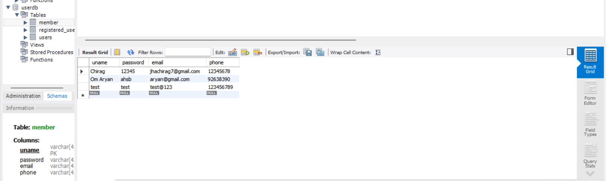

# SignUp_Page_Using_Jsp
web xml put your xml file in web content and WEB-INF folder, web.xml file is deployment descriptor for the Web application that the Web service is a part of. It declares the filters and servlets used by the service.

Put your jsp file in web content and jsp is to convert the java code and put it to the web using jsp->java server page.
in my case i have made three files which are java files;
i)Register.java -> where i have taken the name,email,etc.and and pass the values to getter and setter i.e->my Member.java file

ii)Member.java -> getters and setters are used to protect the data,for each instance of variable.

iii)RegisterDao.java -> this is for backend where i have used mysql workbench to save the user data, you can user other software also and i have make a connection of workbench to my pc localhost and first created a connetcion and inserted the data.

you can use css to style your page and put the file into the web content of your project.

## Output

### SignUp Page

### database

